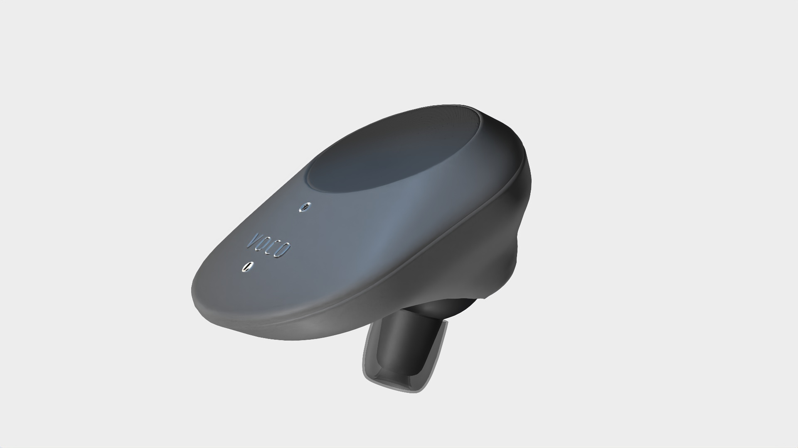
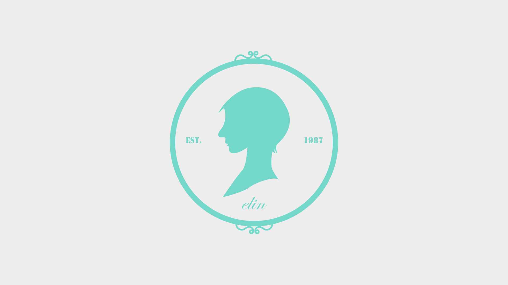
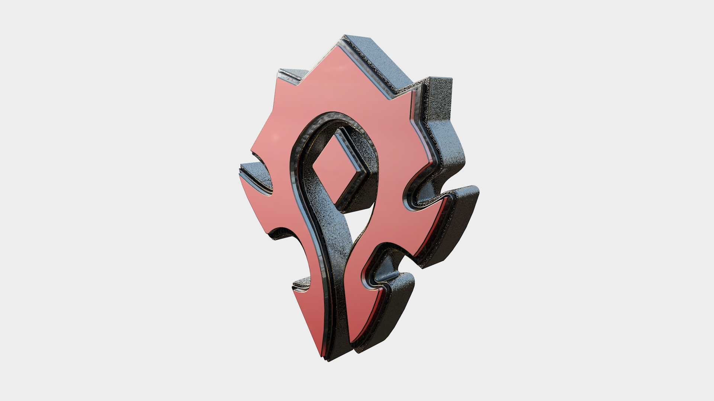
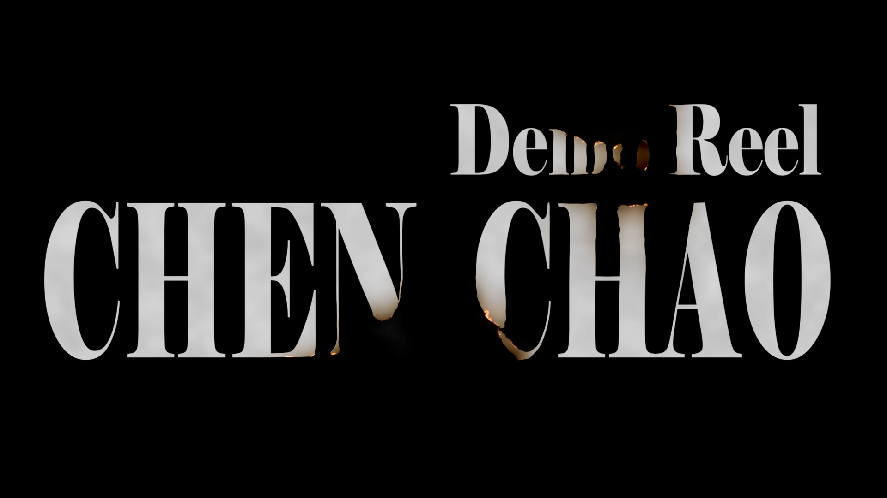
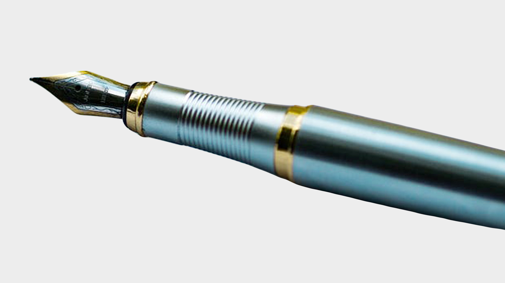

# Chen Chao - Portfolio

## Introduction

Welcome to my portfolio! This repository contains the source code for my portfolio website showcasing my work as a Photographer, Motion Graphic Designer, and Frontend Designer.

## Table of Contents

- [Getting Started](#getting-started)
- [Features](#features)
- [Technologies Used](#technologies-used)
- [Projects](#projects)
- [Contact](#contact)
- [License](#license)

## Getting Started

To view my portfolio, simply open the `index.html` file in a web browser. The portfolio is designed with a mobile-first approach, ensuring a responsive experience on various devices.

## Features

- **Dynamic Animations:** Utilizes GSAP (GreenSock Animation Platform) for dynamic animations throughout the site.
- **Responsive Design:** Designed with a mobile-first approach, ensuring responsiveness on all screen sizes.
- **Project Showcase:** Displays a collection of my projects with interactive lightbox features.
- **Contact Form:** Allows visitors to reach out through a simple contact form.

## Technologies Used

- HTML5
- CSS3 (SASS for styling)
- JavaScript (ES6+)
- GSAP (GreenSock Animation Platform)
- Lightbox for image display

## Projects

### 1. VOCO Earbuds
- 
- [View More](earbuds.html)

### 2. Elin
- 
- [View More](elin.html)

### 3. Animation Project
- 
- [View More](po_logo.html)

### 4. Motion Graphic
- 
- [View More](motion_graphic.html)

### 5. Demo
- 
- [View More](demo reel.html)

### 6. Study Case
- 
- [View More](case study.pdf)

## Contact

Feel free to reach out to me for any inquiries or collaborations. You can use the contact form on my website or connect with me through the following channels:

- Email: [c_chen179770@fanshaweonline.ca]
- GitHub: [GitHub Profile](https://github.com/ryanchen888/Portfolio_ChenChao_IDP3.git)

## License

This project is licensed under the [MIT License](LICENSE).
